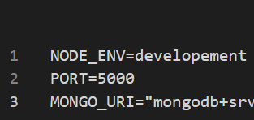
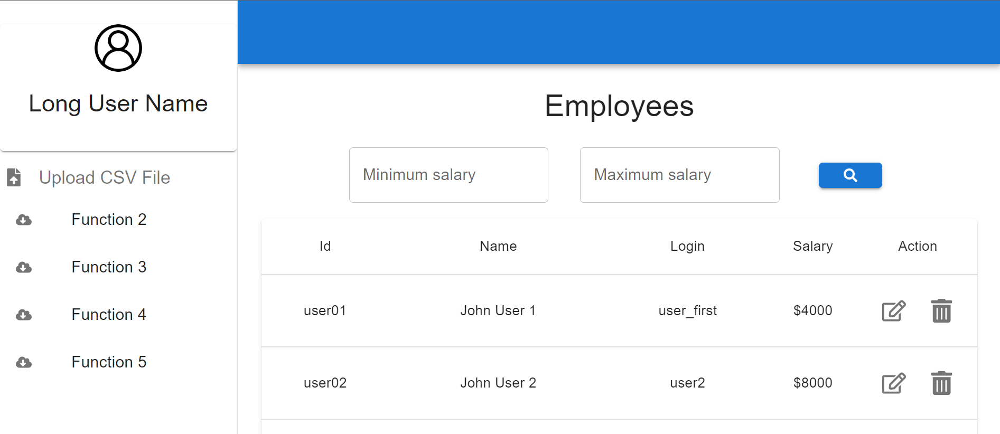

# NPHC_Salary_Management_Webapp using MERN Stack

## Frontend Technology:

React.js

## Backend Technology

Node.js,
Mongodb,
Express.js

## Run the app (Frontend):

In the project directory (frontend folder), you can run:

### `npm install` to install all the dependencies

### `npm start`

Runs the app in the development mode.\
Open [http://localhost:3000](http://localhost:3000) to view it in your browser.

The page will reload when you make changes.\
You may also see any lint errors in the console.

## Run the app (backend):

In the project directory (backend folder), you can:

### `run npm install` to install all the dependencies

### `Configure Mongodb`

- Create a database in Mongodb.
- Connect mongodb to the app by copying the uri string.
- Create a .env file in the backend folder and create a variable for the mongodb uri. Use `MONGO_URI` as the uri variable name in the .env file and assign the string value (get from Mongodb database connection uri) to the variable.
- Create two other varaibles (NODE_ENV and PORT). Assign NODE_ENV value to `development` and PORT value to `5000`.
- Below is the sample for the varibales in the .env file

## App sample

Here is the sample of the app

